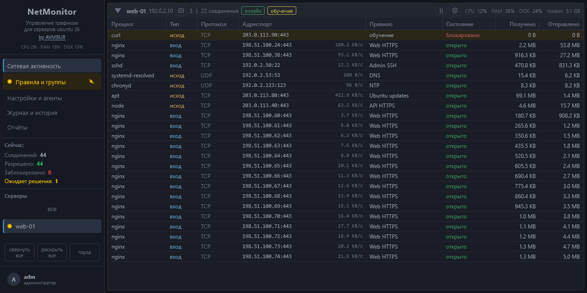
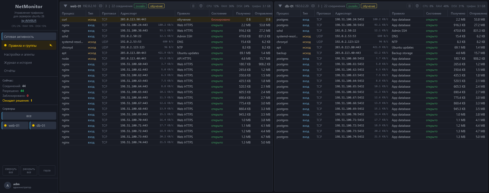
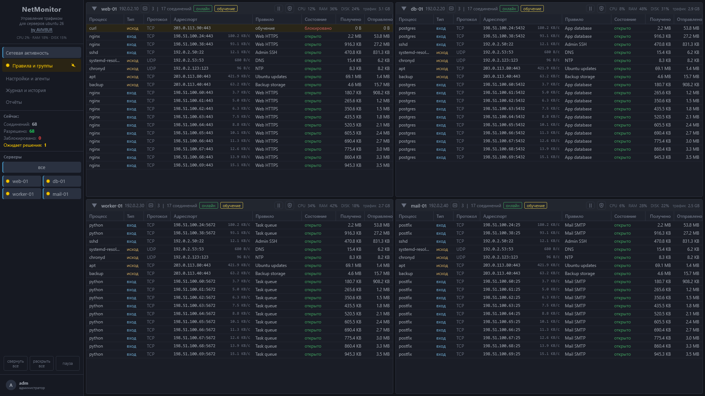

# NetMonitor

**Мониторинг сети и управление firewall серверов Ubuntu: процессы, трафик, обучение, правила, автобаны и отчёты в одном веб-интерфейсе.**

NetMonitor показывает, какие процессы принимают и открывают соединения, сколько данных они передают и какие правила к ним применяются. Из строки активности можно разрешить контакт, создать правило или заблокировать адрес на одном сервере, нескольких выбранных или всём парке.

**Версия 1.0.7 · 09.10.2026** · [Журнал изменений](CHANGELOG.md) · [Лицензия AGPL-3.0](LICENSE)

В этом выпуске базу можно сжать до заданного размера. Монитор удаляется из интерфейса: только эта машина или вместе с агентами. Прежний агент переподключается к новой установке с тем же удостоверением.

[Возможности](#возможности) · [Установка](#установка) · [Как устроено хранение](#как-устроено-хранение) · [Разработка](#разработка)

[](.github/images/activity-detail.png)

*Текущий интерфейс в Firefox, окно 1280 × 640. Выбран один сервер, чтобы столбцы оставались читаемыми. Имена серверов, адреса и показатели демонстрационные. Нажмите на изображение для полного размера.*

<details>
<summary>Обзор двух серверов в одном окне — 1920 × 760</summary>

[](.github/images/activity.png)

</details>

<details>
<summary>Обзор четырёх серверов в одном окне — 1920 × 1080</summary>

[](.github/images/activity-four.png)

*Демонстрационные данные. Нажмите на изображение для полного размера.*

</details>

## Возможности

| Возможность | Что можно делать |
| --- | --- |
| **Парк в одном окне** | Видеть отдельные плитки серверов, состояние связи, CPU, RAM, диск, слушающие порты и суточный трафик. Выбирать серверы, менять порядок плиток, сворачивать их и ставить ленту на паузу. |
| **Подробности соединений** | Смотреть процесс и путь к нему, входящее или исходящее направление, протокол, адрес и порт, DNS-имя, правило, состояние, принятые и отправленные байты, текущую скорость. |
| **Действия из строки** | Открывать контекстное меню по процессу или адресу: создавать правила, разрешать и запрещать контакты, управлять банами и группами, смотреть WHOIS. |
| **Обучение** | Получать вопросы о неизвестных контактах и сохранять решения как правила. Задавать режим для всего парка или отдельного сервера. |
| **Правила** | Сопоставлять IP и подсети, DNS-имена, процессы, протоколы, направление и порты. Протокол «любой» вместе с портом закрывает на этом порту tcp и udp. Выбирать серверы и исключения, задавать срок действия и порядок правил. Новая группа, созданная из окна правила, сразу в нём выбрана. |
| **Группы адресов** | Объединять адреса в именованные группы с общей политикой и областью применения. |
| **Ручные блокировки** | Блокировать адрес, сочетание адреса и порта либо локальный порт. Задавать срок, снимать или продлевать бан и видеть подтверждение применения на агентах. |
| **Автоматическая защита** | Обнаруживать сканирование портов и перебор SSH, блокировать источники, усиливать баны при повторных попытках. |
| **Управление защитой** | Включать карантин сервера, временно приостанавливать автобаны и вести список «никогда не блокировать». |
| **Тревоги** | Видеть потерю связи, проблемы сбора и применения firewall, нехватку места и другие события. Настраивать звуки вопросов и тревог. |
| **Журнал действий** | Видеть, кто изменил правило, поставил или снял бан, сменил режим, подтвердил агента или восстановил firewall. |
| **4 отчёта защиты** | Сканеры портов, неудачные SSH, заблокированные сейчас и настойчивые баны. Данные открываются сразу. |
| **Управление агентами** | Получать команду установки в интерфейсе, подтверждать новые агенты, проверять связь, очередь доставки и применённую ревизию политики. **Забыть** убирает строку и оставляет программу: историю можно продолжить. **Удалить с сервера** снимает программу и её фильтрацию после подтверждения машины; то же доступно ожидающему и карантинному агенту. После переустановки монитора с сохранённым удостоверением агент возвращается кнопкой **переподключить**. **Удалить монитор** снимает эту машину отдельно или вместе с агентами. |
| **SQLite** | Предел размера базы задаётся в мегабайтах, по умолчанию 2048 МБ, шаг 1. При упоре в предел вытесняются самые старые снятые баны и адреса перебора. Действующие баны, правила и открытые вопросы не вытесняются. **Очистить базу** оставляет не меньше 64 МБ: настройки, правила, агенты и действующие баны на месте. |

<details>
<summary>Отчёты защиты</summary>

- Сканеры портов.
- Неудачные входы по SSH за последние 10 минут и запомненные адреса перебора.
- Текущие блокировки.
- Настойчивые баны.

</details>

## Как это работает

```text
Серверы Ubuntu                               Сервер мониторинга
┌────────────────────────────┐               ┌──────────────────────────┐
│ nmagent                    │  HTTPS / mTLS │ nmserver                 │
│ соединения, DNS, SSH        ├──────────────►│ приём событий + SQLite   │
│ локальная очередь доставки │◄──────────────┤ правила и команды        │
│ применение firewall        │ ответ на опрос│ веб-интерфейс            │
└────────────────────────────┘               └─────────────┬────────────┘
                                                         │ HTTPS
                                                      Браузер
```

- **Агент** собирает соединения и счётчики через conntrack, блокировки через NFLOG, DNS-ответы и неудачные входы SSH из journald. Для применения правил используется nftables; предусмотрен резервный backend iptables + ipset.
- **Монитор** принимает события, держит текущие соединения в памяти, сохраняет служебные данные, управляет политикой и отдаёт веб-интерфейс. Оба компонента написаны на Go.
- **Связь** инициирует агент: дополнительные входящие порты для NetMonitor на наблюдаемых серверах не нужны. Регистрация использует одноразовый токен, дальнейший обмен — взаимную проверку TLS-сертификатов.
- **При недоступном мониторе** агент продолжает применять сохранённую политику. Телеметрия ждёт отправки только в памяти, с пределом очереди 32 МБ. После перезапуска монитора или переполнения очереди агент начинает новый поток и присылает свежий снимок соединений. Вопросы обучения сохраняются на диске и доставляются с защитой от повторной обработки.

Наблюдение охватывает IPv4 и IPv6 самого сервера. Трафик различается по области: интернет, LAN, свои серверы и overlay-сети. Сбор Docker-трафика включается отдельно. Для наблюдения за гостевой виртуальной машиной агент устанавливается внутри неё.

Счётчики отражают сетевой объём на уровне IP. Короткое соединение может завершиться до определения процесса; пропуски сбора и неполные данные отмечаются отдельно.

## Установка

### Требования

- Ubuntu с systemd; агенту нужны права root для сбора сетевых событий и управления firewall.
- Архитектура amd64 или arm64.
- Доступ агентов и браузера к HTTPS-порту монитора, по умолчанию `8443`.
- Для работы с интерфейсом — настольный браузер; основной формат — Firefox на экране 1920 × 1080.

### 1. Соберите комплект

На машине сборки нужны **Go 1.25.1 или новее** и **Python 3**. Из корня репозитория:

```sh
python3 tools/build_release.py --arch amd64
```

Для arm64 замените `amd64` на `arm64`. Скрипт создаст архив `dist/netmonitor-linux-amd64.tar.gz`: установщик и два бинарника, `nmserver` и `nmagent`. Версия сборки берётся из метки `vX` на текущем коммите или из `--version`. Python на целевых серверах не требуется.

### 2. Установите монитор

Перенесите комплект на сервер Ubuntu и выполните:

```sh
tar -xzf netmonitor-linux-amd64.tar.gz
cd netmonitor-linux-amd64
sudo sh install.sh
```

Установщик запросит адрес, порт, пароль администратора и необходимость агента на самом мониторе, затем создаст службы systemd. Откройте напечатанный HTTPS-адрес и войдите как `adm` с заданным паролем. Сертификат выпускается локальным центром сертификации проекта; при первом входе браузер потребует подтвердить доверие.

По умолчанию установщик переводит управление firewall на NetMonitor и отключает обнаруженные прежние службы firewall. Параметр `--no-fw` пропускает их отключение.

### 3. Подключите серверы

В разделе **«Настройки и агенты»** выберите **«Установить агент»**, скопируйте команду и выполните её на нужном сервере. Подтвердите появившийся агент в интерфейсе.

Начните с режима обучения: просмотрите неизвестные контакты, сохраните нужные правила и проверьте статус применения политики на агентах.

### Обновление и диагностика

В разделе **«Настройки и агенты»** кнопка **Проверить обновление** смотрит последний релиз на GitHub. **Установить монитор** и **Установить агентам** — отдельные действия. База монитора сохраняется. Агент этой версии ставит себе новую сборку сам и возвращает прежнюю, если новая не запустилась. Агент выпуска 1.0 команду обновления ещё не выполняет: его один раз переставляют командой установки.

Повторный запуск `sudo sh install.sh` из нового комплекта по-прежнему обновляет монитор с сохранением базы. Вместе с установщиком 1.0.1 появляется служба `nm-update`, без неё кнопка монитора только готовит запрос.

```sh
systemctl status nmserver
journalctl -u nmserver --since today

# На сервере с агентом
systemctl status nmagent
journalctl -u nmagent --since today
```

## Как устроено хранение

Основная база монитора — `/var/lib/nmserver/netmon.sqlite`. В настройках задаётся предел размера, по умолчанию **2048 МБ**. Сроков хранения трафика нет: потоки и пробы на диск не пишутся. После перезапуска монитора живой экран заполняется заново, счётчики и короткие окна наблюдения начинаются с нуля. Правила, вопросы, баны, журнал действий и сохранённые адреса перебора SSH остаются.

Когда новая запись требует превысить предел, удаляется самая старая доступная история в общем порядке по времени между таблицами. Удаление и сохранение новых данных проходят в одной транзакции. Действующие правила, открытые вопросы и служебные данные, необходимые для доставки и защиты, не считаются удаляемой историей. Если освободить место нельзя, запись не подтверждается агенту.

SQLite использует WAL; журнал и временные операции требуют дополнительного свободного места. Лимит рабочей базы не является лимитом всего каталога данных.

В `/var/lib/nmserver/snapshots/` остаётся **один последний снимок**. Он создаётся автоматически раз в сутки или вручную из интерфейса. В `/var/lib/nmagent/agent.sqlite` агент хранит служебную очередь, вопросы, последнюю политику и данные доступа. Телеметрия и снимки соединений в эту базу не записываются.

Копия удостоверения монитора лежит в `/var/lib/nm-trust`. «Только монитор» её не стирает, поэтому новая установка узнаётся прежними агентами. «Монитор и агенты» стирает и её.

## Разработка

```sh
go test ./...
go vet ./...
python3 tools/build_release.py --arch amd64
```

Проверки реального firewall требуют Linux и отдельного окружения с сетевыми пространствами имён. Вспомогательный сценарий — [tools/test_linux_firewall.sh](tools/test_linux_firewall.sh); обычный запуск Go-тестов на Windows их не выполняет.

| Каталог | Содержимое |
| --- | --- |
| `cmd/` | Точки входа монитора и агента. |
| `internal/` | Сбор событий, доставка, политика, firewall, хранилище, сервер и веб-интерфейс. |
| `deploy/` | Установщик и встраиваемые ресурсы. |
| `tools/` | Сборка комплекта и проверки Linux-firewall. |
| `.github/images/` | Демонстрационные скриншоты интерфейса. |

Текстовые файлы сохраняются в UTF-8 с окончаниями строк LF.

## Автор

Avmbur · [GitHub](https://github.com/Avmbur) · [Telegram](https://t.me/neocortex38)

## Лицензия

Copyright (c) 2026 Avmbur. Распространяется на условиях
[GNU AGPL-3.0](LICENSE).
